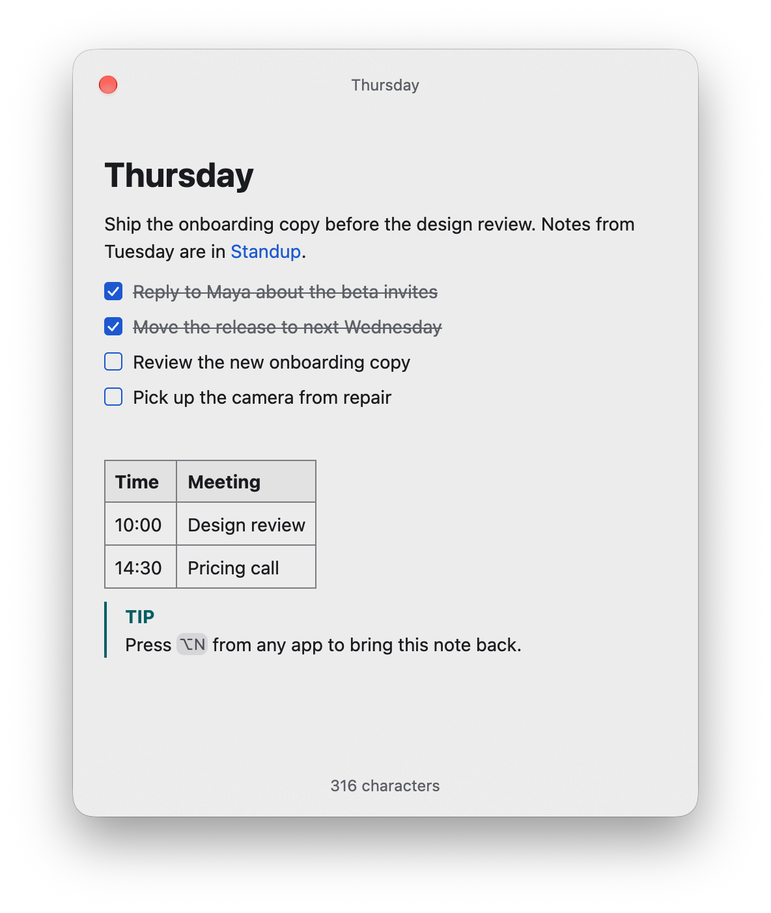
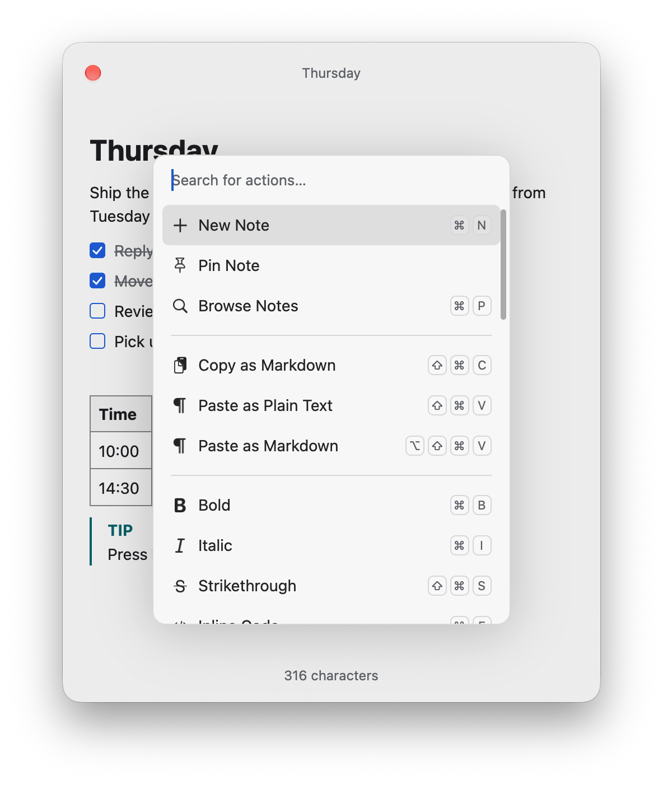
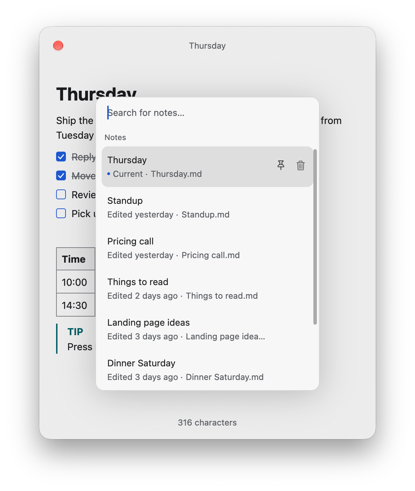

<p align="center">
  
</p>

<h1 align="center">Markraft</h1>

<p align="center">
  A floating Markdown notepad for macOS that keeps notes as .md files in a folder you choose.<br>
  An open source alternative to Raycast Notes.
</p>

<p align="center">
  
  <a href="LICENSE"></a>
  <a href="https://github.com/ahonn/markraft/releases/latest"></a>
</p>

<p align="center">
  
</p>

Press <kbd>⌥N</kbd> in any app to bring back the note you were writing, and press it again to put it away. Notes are Markdown files, so any other editor can open them too.

<p align="center">
  <a href="https://github.com/ahonn/markraft/releases/latest"><b>Download for macOS</b></a>
  · <a href="#installation">Installation</a>
</p>

## Features

- **Floating window.** <kbd>⌥N</kbd> shows or hides it over the current app. It stays on top, grows with the note, and can appear on every Space or on the screen with the pointer. A second hotkey for a new note can be set in Settings.
- **Live Markdown.** Formatting is shown as you type; the Markdown syntax appears around the caret only.
- **Tables, links and more.** Tables edited cell by cell, task lists, `[[wiki links]]` with completion, callouts, footnotes, images and highlighted code blocks.
- **Plain files.** Each note is a `.md` file. A save rewrites only the lines you edited and leaves the rest of the file unchanged.
- **Keyboard.** <kbd>⌘K</kbd> lists every action with its shortcut, <kbd>/</kbd> inserts a block, and vim mode can be turned on in Settings.
- **Native.** Written in Rust and drawn with [GPUI](https://www.gpui.rs), without a web view.

<p align="center">
  
  
</p>

## Installation

Download the `.dmg` from the [latest release](https://github.com/ahonn/markraft/releases/latest), open it, and drag Markraft to Applications. Markraft is signed and notarized, and updates itself through Sparkle. It needs macOS 13 or later.

Markraft runs from the menu bar and has no Dock icon.

## Shortcuts

| Shortcut | Action |
| --- | --- |
| <kbd>⌥N</kbd> | Show or hide the window |
| <kbd>Esc</kbd> | Hide the window |
| <kbd>⌘N</kbd> | New note |
| <kbd>⌘P</kbd> | Find a note |
| <kbd>⌘K</kbd> | All actions |
| <kbd>⌘O</kbd> | Open a Markdown file |
| <kbd>⌘,</kbd> | Settings |
| <kbd>/</kbd> | Insert a heading, list, table, code block and more |
| <kbd>[[</kbd> | Link to another note |

## Your notes

Notes are Markdown files in `~/Documents/Markraft` by default. You can choose another folder, including one you already keep notes in, and open any other `.md` file on your Mac.

- Changes made by other apps show up in the open note. If another app changes a file at the same moment you edit it, your version is kept as a separate conflicted copy.
- Deleting a note moves its file to the Trash.
- To sync notes between Macs, put the folder in iCloud Drive or another sync tool. Settings and window state stay on each Mac in `~/Library/Application Support/Markraft`.

## Settings

- **General:** launch at login, the hotkeys, light or dark appearance, and how the window floats, hides and which note it opens with.
- **Editor:** font, text size, line height and width, vim mode, and whether images linked from the web load.
- **Markdown:** the markers Markraft writes for lists, emphasis, code blocks and line breaks.
- **Files:** the notes folder, and where new notes and pasted images are saved and how they are named.

## Privacy

Markraft has no account and sends no telemetry. It connects to the network only to check for updates and to load images that notes link to on the web; both can be turned off in Settings.

## Crash reports

Logs and crash reports are written to `~/Library/Logs/Markraft` and stay on your Mac. After a crash, Markraft mentions the report on its next launch. **Report an Issue…** in <kbd>⌘K</kbd> opens a GitHub issue with your Mac and Markraft versions filled in; attach the report if there is one.

## Contributing

Bug reports and pull requests are welcome. For a change in behavior, please open an issue to discuss it first.

```sh
bash scripts/download-sparkle.sh   # fetch the Sparkle framework into target/sparkle
cargo run -p markraft-app          # run the app
cargo test --workspace             # run the tests
cargo xtask bundle                 # build target/debug/bundle/osx/Markraft.app
```

The toolchain is pinned in `rust-toolchain.toml`. The workspace is split into `markraft-core` (document model and editing), `markraft-commonmark` (Markdown), `markraft-gpui` (the editor view), `markraft-vim` and `markraft-app`.

## Acknowledgments

Built on [GPUI](https://www.gpui.rs), with [comrak](https://github.com/kivikakk/comrak) for parsing Markdown, [syntect](https://github.com/trishume/syntect) for highlighting code and [Sparkle](https://sparkle-project.org) for updates.

## License

[MIT](LICENSE)
