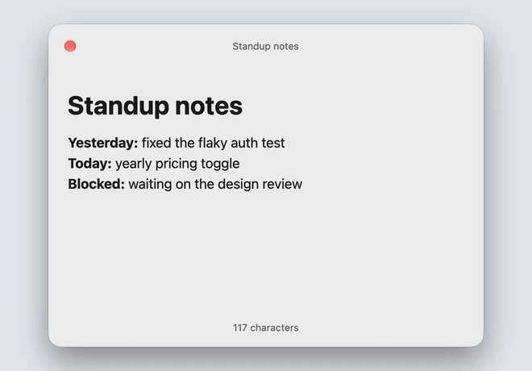
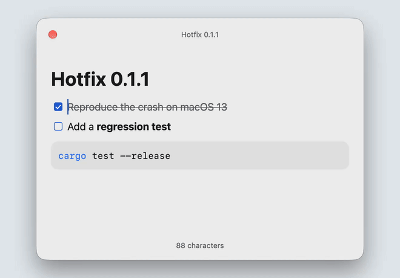
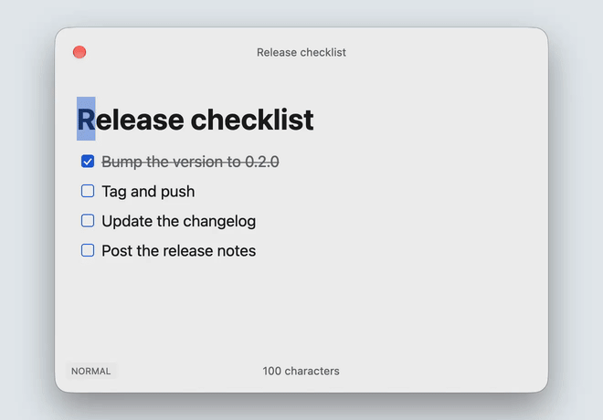

<p align="center">
  
</p>

<h1 align="center">Markraft</h1>

<p align="center">
  The floating Markdown notepad for Mac.<br>
  An open source alternative to Raycast Notes.
</p>

<p align="center">
  
  <a href="LICENSE"></a>
  <a href="https://github.com/ahonn/markraft/releases/latest"></a>
</p>

<p align="center">
  
</p>

Press <kbd>⌥N</kbd> in any app to write, and again to put it away. Notes are plain Markdown files in a folder you choose, so any other editor can open them too.

<p align="center">
  <a href="https://github.com/ahonn/markraft/releases/latest/download/Markraft.dmg"><b>Download for macOS</b></a>
  · <a href="#installation">Installation</a>
</p>

## Features

- **Floating window.** <kbd>⌥N</kbd> shows or hides it over the current app. It stays on top, grows with the note, and can appear on every Space or on the screen with the pointer. A second hotkey for a new note can be set in Settings.
- **Live Markdown.** Formatting is shown as you type, in the style of Typora; inline marks such as `**` appear around the caret only.
- **Tables, links and more.** Tables edited cell by cell, task lists, `[[wiki links]]` with completion, callouts, footnotes, images and highlighted code blocks.
- **Math.** LaTeX formulas, `$…$` inline and `$$…$$` as blocks, rendered offline through [RaTeX](https://github.com/erweixin/RaTeX), with optional equation numbers and references.
- **Plain files.** Each note is a `.md` file. A save rewrites only the lines you edited and leaves the rest of the file unchanged.
- **Keyboard.** <kbd>⌘K</kbd> lists every action with its shortcut, <kbd>/</kbd> inserts a block, and vim mode can be turned on in Settings.
- **Context menu.** Right-click or Control-click to edit the selection, paste plain text or Markdown, and work with links, code blocks and tables using a native macOS menu.
- **Native.** Written in Rust and drawn with [GPUI](https://www.gpui.rs), without a web view.

<p align="center">
  
  
</p>

## Installation

Download [Markraft.dmg](https://github.com/ahonn/markraft/releases/latest/download/Markraft.dmg) from the [latest release](https://github.com/ahonn/markraft/releases/latest), open it, and drag Markraft to Applications. Markraft is signed and notarized, and updates itself through Sparkle. It needs macOS 13 or later.

Markraft runs from the menu bar and has no Dock icon.

## Shortcuts

| Shortcut | Action |
| --- | --- |
| <kbd>⌥N</kbd> | Show or hide the window |
| <kbd>Esc</kbd> | Hide the window (`:q` in vim mode) |
| <kbd>⌘N</kbd> | New note |
| <kbd>⌘P</kbd> | Find a note |
| <kbd>⌘K</kbd> | All actions |
| <kbd>⌘O</kbd> | Open a Markdown file |
| <kbd>⌘,</kbd> | Settings |

## Vim mode

Turn on **Vim mode** in Settings → Editor. The editor starts in Normal mode and shows the current mode.

<p align="center">
  
</p>

Normal, Insert, Visual and Visual Line modes work with the usual motions, operators, counts and text objects, `/` search, and common commands such as `:w`, `:q` and `:wq`. `dd` and `yy` take a whole Markdown block, so a list item keeps its nesting when pasted. In Normal mode <kbd>Esc</kbd> does not hide the window; use `:q`.

`f` and `t`, `.` repeat, registers, `?` and regular expressions are not supported.

## Your notes

Notes are Markdown files in `~/Documents/Markraft` by default. You can choose another folder, including one you already keep notes in, and open any other `.md` file on your Mac.

- Changes made by other apps show up in the open note. If another app changes a file at the same moment you edit it, your version is kept as a separate conflicted copy.
- Deleting a note moves its file to the Trash.
- To sync notes between Macs, put the folder in iCloud Drive or another sync tool. Settings and window state stay on each Mac in `~/Library/Application Support/Markraft`.

## Privacy

Markraft has no account and sends no telemetry. It connects to the network only to check for updates and to load images that notes link to on the web; both can be turned off in Settings.

## Contributing

Bug reports and feature requests are welcome as issues. Pull requests are open to collaborators only, so to propose a change, please open an issue and describe it there.

**Report an Issue…** in <kbd>⌘K</kbd> opens an issue with your Mac and Markraft versions filled in. Logs and crash reports are written to `~/Library/Logs/Markraft` and stay on your Mac; attach the report if there is one.

To build from source, install Rust and Xcode 16 or newer with its command-line tools.
Packaging requires Xcode 26 or newer to compile the Icon Composer app icon.
If you have multiple Xcode versions, set `DEVELOPER_DIR` to the selected version's `Contents/Developer` directory.
The macOS translation bridge is compiled with the bundled Swift compiler:

```sh
bash scripts/download-sparkle.sh   # fetch the Sparkle framework into target/sparkle
cargo run -p markraft-app          # run the app
cargo test --workspace             # run the tests
cargo xtask bundle                 # build target/debug/bundle/osx/Markraft.app
```

See [the architecture notes](docs/architecture.md) for how the workspace is divided, and [the localization guide](docs/localization.md) for adding a language. To contribute a translation, attach the message files to an issue.

## Acknowledgments

Markraft borrows ideas from [Raycast Notes](https://www.raycast.com/core-features/notes), [Typora](https://typora.io) and [Obsidian](https://obsidian.md). It is built on [GPUI](https://www.gpui.rs), with [comrak](https://github.com/kivikakk/comrak) for parsing Markdown, [syntect](https://github.com/trishume/syntect) for highlighting code and [Sparkle](https://sparkle-project.org) for updates.

## License

[MIT](LICENSE)
